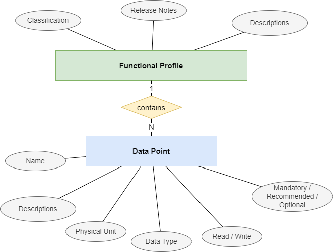
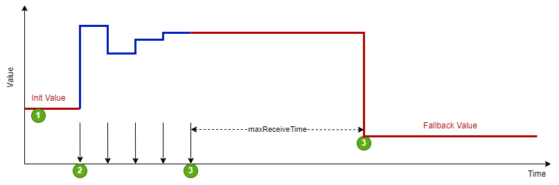
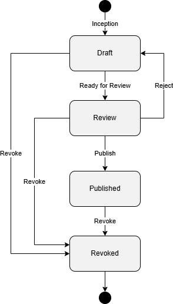

.. _functional-profiles:

|planner| |supplier| |grid| |dev| Functional Profiles
=====================================================

A :term:`Functional Profile` describes a set of related functionalities provided by a :term:`Product`.
It thereby focuses entirely on the functionality. Any transport-specific details are not part of the functional profile
(e.g. on how to get or set a :term:`Data Point` on a specific product).

The main intent is to allow communicator manufacturers to easily implement their use cases based on logically grouped
:term:`Data Points`, while device-specific communication details are handled SmartGridread Communication Handler library.

Any :term:`Product` that supports the :term:`Functional Profiles` required for a specific use case is therefore automatically
compatible and can be used without changing the :term:`Communicator` implementation.

The :term:`Functional Profiles` build the foundation of the SmartGridready specification and allow access to any
SmartGridready compliant :term:`Product` through a generic API.

The SmartGridready library lists the currently available :term:`Functional Profiles`:
See `Functional Profile Library <https://library.smartgridready.ch/FunctionalProfileTemplate>`_

This list of :term:`Functional Profile` definitions is subject to change and will grow in the future, as new
:term:`Functional Profiles` will be added.

As a :term:`Product` supplier you need check which :term:`Functional Profiles` suit your :term:`Product`'s functionalities
and add the matching :term:`Functional Profiles` to the :term:`External Interface Definition` file.

:term:`Functional Profile` Structure
------------------------------------

:numref:`figure_functional_profile_structure` shows the basic structure of a :term:`Functional Profile`

.. _figure_functional_profile_structure:

   Functional Profile Structure

A :term:`Functional Profile` is part of a :term:`Product` description and includes the:

* Definition of the :term:`Functional Profile` with identification and description.
* :term:`Data Points` defining access points to measure and control data on the :term:`Product`.

Example:

.. code-block:: none

   PRODUCT
   ├── DEFINITION (Generic product info ...)
   │
   ├── FUNCTIONAL-PROFILE (ActiveEnergyAC)
   │   ├── DATAPOINT (ActiveEnergyACTot)
   │   ├── DATAPOINT (ActiveEnergyACTot)
   │   ├── DATAPOINT (ActiveEnergyACL1)
   │   ├── DATAPOINT (ActiveEnergyACL3)
   │   └── DATAPOINT (ActiveEnergyACL3)
   │
   └──FUNCTIONAL-PROFILE (ActivePowerAC)
       ├── DATAPOINT (ActivePowerACTot)
       ├── DATAPOINT (ActivePowerACL1)
       ├── DATAPOINT (ActivePowerACL3)
       └── DATAPOINT (ActivePowerACL3)

The illustration above shows a sample for the structure of a :term:`Product` description file in XML (:term:`EID`).
The :term:`Product` description exposes its functionalities by including two :term:`Functional Profiles`.
The example shows a simple :term:`Smart Meter` that exposes AC-energy metering and AC-power measurement functionalities.

A :term:`Communicator` software can read from or write to the device by addressing the :term:`Data Point` by
:term:`Functional Profile` name and :term:`Data Point` name. Java code example:

.. code-block:: java

    var acPowerTotal = meteringDevice.getVal("ActiveEnergyAC", "ActiveEnergyACTot");

A functional profile is defined/identified by:

* **Functional Profile Category:** see :ref:`functional_profile_category`
* **Functional Profile Type:** see: :ref:`functional_profile_type`
* **Level Of Operation:** see :ref:`level_of_operation`
* **Version Number:** see :ref:`version_number`

.. _functional_profile_category:

:term:`Functional Profile Category`
-----------------------------------

The :term:`Functional Profile Category` is related the type of a :term:`Product` and its functionalities.

The list below shows the currently published :term:`Functional Profile Categories` (follow the links for a detailed
description):

.. list-table::
    :widths: 23 54 23
    :header-rows: 1

    * - Category
      - Assigned to :term:`Functional Profiles` used with :term:`Products` of type:
      - Details page

    * - **Actuator**
      - Used with actuator :term:`Products`. Examples for actuator devices are electrical relays, servo motors etc.
      - :ref:`actuator`

    * - **Battery**
      - Used with battery :term:`Products`, e.g. batteries that store electrical energy produced by a :term:`PVA`.
      - :ref:`battery`

    * - **BatterySystem**
      - Used with combined systems that consist of a battery and an :ref:`Inverter`
      - :ref:`battery-system`

    * - **DeviceInformation**
      - Has no predefined :term:`Data Points`. Used to provide device information and add manufacturer proprietary
        :term:`Data Points`.
      - :ref:`device-information`

    * - **DynamicTariff**
      - Used to query dynamic tariff information from a power grid operator system.
      - :ref:`dynamic-tariff`

    * - **EVSE**
      - Used for Electrical Vehicle Supply Equipment (:term:`EVSE`) :term:`Products` like charging stations.
      - :ref:`evse`

    * - **HeatingCircuit**
      - Used with :term:`Products` that allow reading information from a heating circuit, such as temperature.
      - :ref:`heating-circuit`

    * - **HeatPumpControl**
      - Used with :term:`Products` that allow controlling heat pumps and reading information from heat pumps.
      - :ref:`heating-circuit`

    * - **Inverter**
      - Used with :term:`Products` that allow controlling and reading status from :term:`PV-Inverter` devices
      - :ref:`inverter` and :ref:`battery-system` devices.

    * - **Metering**
      - Used with :term:`Products` that provide metering an measurement functionalities like electrical power or energy
        consumption, for example smart meter devices.
      - :ref:`metering`

    * - **SGCP**
      - Used for Smart Grid Connection Point (:term:`SGCP`) :term:`Products`.
      - :ref:`sgcp`

    * - **Sensor**
      - Used with :term:`Products` that allow reading data from sensor devices, for example a humidity sensor.
      - :ref:`sensor`

.. toctree::
    :maxdepth: 1
    :hidden:

    functional-profile-categories/actuator
    functional-profile-categories/battery
    functional-profile-categories/battery-system
    functional-profile-categories/device-information
    functional-profile-categories/dynamic-tariff
    functional-profile-categories/evse
    functional-profile-categories/heating-circuit
    functional-profile-categories/heatpump-control
    functional-profile-categories/inverter
    functional-profile-categories/metering
    functional-profile-categories/sgcp
    functional-profile-categories/sensor

.. _functional_profile_type:

:term:`Functional Profile Type`
-------------------------------

The :term:`Functional Profile Type` defines the set of functionalities provided by a :term:`Functional Profile`.
:term:`Functional Profiles` of a given type can appear in multiple :term:`Functional Profile Categories`.
For example, the EnergyMonitor :term:`Functional Profile Type` may be implemented by devices in the
:ref:`heatpump-control`, :ref:`battery`, and :ref:`battery-system` categories.

Even if a :term:`Functional Profile Type` defines a distinct set of functionalities the the functional profile
can come in different flavours defined by the :ref:`functional_profile_category` and :ref:`level_of_operation`.

Therefore a :term:`Functional Profile` is uniquely defined by:

* Functional Profile Category: see :ref:`functional_profile_category`
* Functional Profile Type: see: :ref:`functional_profile_type`
* Level Of Operation: see :ref:`level_of_operation`
* Version Number: see :ref:`version_number`

.. list-table:: :term:`Functional Profile Type`
    :header-rows: 1
    :widths: 25 50 25

    * - :term:`Functional Profile Type`
      - Description
      - Used with :term:`Functional Profile Category`
    * - ActiveEnergyAC
      - Provides AC energy metering :term:`Data Points` for single phase, multi phase and total energy consumption.
      - :ref:`metering`
    * - ActiveEnergyBalanceAC
      - Provides energy balance metering :term:`Data Points` providing data for imported, exported and net energy towards
        the power grid.
      - :ref:`metering`
    * - ActivePowerAC
      - Provides AC power measurement for single phase, multi phase and total power consumption.
      - :ref:`metering`
    * - ApparentEnergyAC
      - Provides :term:`Data Points` for AC apparent energy metering. Supports single phase, multi phase and total
        apparent energy metering.
      - :ref:`metering`
    * - ApparentPowerAC
      - Provides :term:`Data Points` for AC apparent power measurement. Supports single phase, multi phase and total
        apparent power measurements.
      - :ref:`metering`
    * - BufferStorageCtrl
      - This :term:`Functional Profile` type extends the **HeatPumpBase** :term:`Functional Profile` type. It provides
        :term:`Data Points` to read temperature from and control heat pump buffer storage devices.
      - :ref:`heatpump-control`
    * - CurrentAC
      - Provides :term:`Data Points` for AC current measurements. Supports single phase, multi phase and current
        against the neutral conductor measurements.
      - :ref:`metering`
    * - CurrentDC
      - Defines a single :term:`Data Point` to measure DC current.
      - :ref:`metering`
    * - DeviceInformation
      - Empty functional profile without data points that can be used for vendor specific information and data points.
        It allows the handling of data points, which are valid for the whole device.
      - :ref:`device-information`
    * - DomHotWaterCtrl
      - This :term:`Functional Profile` type extends the **HeatPumpBase** :term:`Functional Profile`. It provides
        :term:`Data Points` that are available for controlling a domestic hot water circuit.
      - :ref:`heatpump-control`
    * - EMS_Current_Limit
      - This :term:`Functional Profile` type enables a controller to set a current limitation for a charging station
        (Electric Vehicle Supply Equipment, :term:`EVSE`).
      - :ref:`evse`
    * - ESVEState
      - :term:`Functional Profile` for reading the status of the connector of an electric vehicle charging station
        (:term:`EVSE`).
      - :ref:`evse`
    * - EnergyMonitor
      - :term:`Functional Profile` that supports :term:`Data Points` to read operating data such as energy consumption
        from a :term:`Product`.
      - :ref:`heatpump-control`, :ref:`battery`, :ref:`battery-system`
    * - FlexMgmt
      - :term:`Functional Profile` for Energy Management Systems (term:`EMS`)that expose an interface towards the
        power grid operator (:term:DSO) to control or specify limits on power consumption from the power grid
        and limits for energy feed-in to the power grid.
      - :ref:`SGCP`
    * - Frequency
      - Defines a single :term:`Data Point` to measure AC frequency.
      - :ref:`metering`
    * - HeatCoolCtrl
      - This :term:`Functional Profile` type extends the **HeatPumpBase** :term:`Functional Profile`. It provides
        :term:`Data Points` that are available for controlling a heat pump heating and cooling circuit.
      - :ref:`heatpump-control`
    * - HeatPumpBase
      - This is the basic :term:`Functional Profile` for heat pumps. It allows operation mode control and reading operation
        status and measure temperature etc.
      - :ref:`heatpump-control`
    * - Humidity
      - Defines a single :term:`Data Point` to measure humidity.
      - :ref:`Sensor`
    * - LoadReduction_EVSE
      - :term:`Functional Profile` type to control load reduction of Electrical Vehicle Supply Equipement :term:`EVSE`.
      - :ref:`EVSE`
    * - PowerCtrl
      - :term:`Functional Profile` type to control the power consumption of heat pumps by controlling parameters
        like compressor power consumption or compressor rotations per minute.
      - :ref:`heatpump-control`
    * - PowerFactor
      - Provides :term:`Data Points` to read the power factor defined as:

        .. math::

            PowerFactor = \frac{ActivePower}{ApparentPower}

        It supports single phase, multi phase and overall measurement.
      - :ref:`metering`
    * - Recative Power AC
      - :term:`Functional Profile Type` to measure the reactive power. Supports single phase and multiphase reactive
        power measurement.
      - :ref:`metering`
    * - SG-ReadyStates
      - :term:`Functional Profile Type` for heat pumps that support four operation modes. The operating states are
        defined from SG ready - Bundesverband Wärmepumpe e.V. (bwp):

        * HP_LOCKED: Heat pump blocked - for example fixed blocking by time.
        * HP_NORMAL: Heat pump in normal operation.
        * HP_INTENSIFIED: Switch-on recommendations for increased operation.
        * HP_FORCED: Forced start-up command (as far as this is possible within the control settings of the heat pump).

      - :ref:`heatpump-control`

    * - SG-ReadyStates_bwp
      - :term:`Functional Profile Type` for heat pumps that support two operation modes. The operating states are
        defined from SG ready - Bundesverband Wärmepumpe e.V. (bwp):

        * HP_LOCKED: Heat pump blocked - for example fixed blocking by time (operation mode 1 from SG Ready bwp).
        * HP_NORMAL: Heat pump in normal operation mode (operation mode 2 from SG Ready bwp).

      - :ref:`heatpump-control`
    * - Supplier
      - :term:`Functional Profile Type` for connection points that provide information from the distribution system
        operator :term:`DSO`.
      - :ref:`dynamic-tariff`
    * - UniDirFlexFeedInMgmt
      - :term:`Functional Profile Type` for Energy Management Systems (:term:`EMS`) that expose an interface towards the
        power grid operator (:term:DSO) to control or specify limits on energy feed-in to the power grid.
      - :ref:`sgcp`
    * - UniDirFlexLoadMgmt
      - :term:`Functional Profile Type` for Energy Management Sytems (:term:`EMS`) that expose an interface towards the
        power grid operator (:term:DSO) to control or specify limits on energy consumption from the power grid.
      - :ref:`sgcp`

.. _level_of_operation:

:term:`Level of Operation`
---------------------------

Level Of Operation defines a complexity level of the :term:`Product` device controls:

.. list-table:: Level of Operation
    :header-rows: 1
    :widths: 10 30 60

    * - Level
      - Description
      - Details
    * - m
      - Monitoring
      - Has :term:`Data Points` that provide read functionality.  'm' can be used on its own or combined with one of the
        levels 1-6:

        * When 'm' stands alone, the :term:`Functional Profile` requires only read operations to be supported.
        * When 'm' is combined with a number (e.g. 1m, 2m, 4m), the :term:`Functional Profile` requires both read and
          write operations to be supported for the value type corresponding to the level.

    * - 1
      - On-Off
      - The interface allows switching between two discrete operating states
    * - 2
      - Discrete values
      - The interface allows switching between two multiple discrete operating states
    * - 3
      - Set of characteristic curves
      - The interface enables the selection of various pre-configured characteristic
        curves (Discrete, as there is a limited number of characteristic curves).
        Grid-friendly characteristic curves, which can react to grid voltage, are also
        assigned to this level without communication via the SmartGridready interface.
    * - 4
      - Continuous values
      - The interface allows the setting of continuous values. This stage builds upon
        level 2.
    * - 5
      - Dynamically changeable characteristics tables
      - The interface allows the setting of continuous control parameters or characteristic
        curve values. This stage builds upon level 3.
    * - 6
      - Prediction based systems
      - The interface allows the setting of new setpoints and control parameters /
        characteristic curve values based on energy production or load forecasts, up to
        the inclusion of a digital twin.

(see
`FunctionalProfileDescription.xsd <https://github.com/SmartGridready/SGrSpecifications/blob/master/SchemaDatabase/SGr/Generic/BaseType_LevelOfOperationType.xsd>`__
for details…)

.. _generic_attributes:

Generic Attributes
------------------

Generic attributes incorporate hierarchical inheritance as follows:

- Generic attributes always apply to the data point
- Generic attributes defined on functional profile level apply to all data points of the same
  functional profile.
- Generic attributes defined on device level apply to all functional profiles, and thus to all
  data points of the device If the same attribute is defined on multiple levels the most specific
  definition supersedes any other definition (i.e. data point over functional profile over).

.. _static_datapoint_attributes:

Static Data Point Attributes
^^^^^^^^^^^^^^^^^^^^^^^^^^^^

These values describe the measurement limits for data points. Depending
on the definition level they apply either to a specific data point,
every data point of a functional profile, or the the entire device.

These attributes are generally used to search for devices that fulfill a
set of minimum requirements to support a specific use case.

.. list-table:: Level of Operation
    :header-rows: 1
    :widths: 32 14 34 20

    * - SGr Attribute
      - Data Type
      - Description
      - Example
    * - <MeasuredValueType>
      - enum
      - Kind of the measured value, possible values are 'value', 'min', 'max', 'average', 'stdDev' (standard deviation)
      - value, max ..
    * - <SpecialQualityRequirement>
      - string
      - Indicates the quality requirements fullfilled by the product.
      - METAS
    * - <PrecisionPercent>
      - float32
      - The precision of the measurement, calculated result or the result of a process.
      - 2.0%
    * - <MaximumLatencyTime>
      - float
      - Maximum time in milliseconds from capturing of measured value until available at the product interface.
        (e.g. AD conversion time)
      - 10ms
    * - <SampleRate>
      - unsigned long
      - Sampling rate in millisecond
      - 200ms

.. _stability_fallback:

Stability Fallback
^^^^^^^^^^^^^^^^^^

A consumer or a generating system receives the permit for a load change
for a certain period of time. This time is always set to 0 each time a
confirmation message is received (HeartBeat).

The figure below depicts the typical flow 1. the device starts at
initial value. 2. regular communication starts. The communicator
periodically sets new set values. 3. communication breaks. The device
receives its last set value. 4. after reaching the timeout the device
automatically sets the fallback value.

   SGr Stability Fallback

.. list-table:: Stability Fallback
    :header-rows: 1
    :widths: 26 10 50 14

    * - Stabiltiy Fallback Value
      - Data Type
      - Description
      - Example
    * - <maxReceiveTime>
      - float
      - If the device does not receive any communication within this time the device applies the fallback.
      - 3600.0 s
    * - <initValue>
      - float
      - Initial value the device before the communicator sets this value (e.g.at   startup, obeginning cycle).
      - 6.0 A
    * - <fallbackValue>
      - float
      - Value the device uses in case of a fallback.
      - 6.0 A

.. _smooth_transition:

Smooth Transition
^^^^^^^^^^^^^^^^^

The time behavior of a transition from a power adjustment (positive as
well as negative) can be determined by several time values, so that this
starts with a random time delay, changes via a ramp and an expiry time
with return to the initial value. To avoid return to the initial value
the device must either specify the revert time to zero (i.e. no return),
or the communicator must repeat the target value before the revert time
window expires.

The figure below depicts the typical flow 1. the command for the new
target value is received 2. the device randomly starts the ramp, but
latest after winTms 3. the ramp reaches the new target value after
rmpTms 4. if no new target value is received, the device starts
returning to the old target value after rvtTms 5. the ramp reaches the
old target value after rmpTms

.. figure:: images/genAttributes_smoothTransition.drawio.png
   :alt: SGr Smooth Transition

.. list-table::
    :header-rows: 1
    :widths: 26 14 50 10

    * - Smooth Transition Value
      - Data Type
      - Description
      - Example
    * - <winTms>
      - unsigned long
      - indicates a time window in which the new operating mode is started randomly.
        The time window begins with the start command of the operating mode.
        The value 0 means immediate.
      - 300 s
    * - <rmpTms>
      - unsigned long
      - Specifies how quickly the changes should be made.
        The corresponding value is gradually changed from the old to the new value in the specified time.
      - 450 s
    * - <rvrtTms>
      - unsigned long
      - Determines how long the operating mode should be active. When the time has elapsed, the operating
        mode is automatically terminated. If rvrtTms = 0 (standard value), the operating mode remains active
        until a new command is received.
      - 600 s

.. _datapoint_quality:

Data Point Quality
^^^^^^^^^^^^^^^^^^

SGr has attributes to denote the quality of the measured value. The
presence of any quality attributes either on functional profile or data
point level indicate that the com handler will provide these dynamic
attributes at run time (see documentation of SGr com handler libs)

.. list-table:: Data Point Quality
    :header-rows: 1
    :widths: 28 10 40 22

    * - SGrAttribute
      - Data Type
      - Description
      - Example
    * - <MeasuredValueSource>
      - enum
      - Value source kind related to SGr level 6 applications.
        Potential values are:

        * measuredValue
        * calculatedValue
        * empiricalValue

      - measuredValue

.. _curtailment:

Curtailment
^^^^^^^^^^^

Various function profiles require boundaries to set points with respect
to curtailment or home energy management systems.

.. list-table::
    :header-rows: 1
    :widths: 24 24 32 20

    * - SGr Attribute
      - Data Type
      - Description
      - Example
    * - <Curtailment>
      - float
      - Used in state-based reduction schemes.
        This value specifies the reduction in percent for the reduced operation mode.
      - 40%
    * - <MimimumLoad>
      - float
      - Used in state-based reduction schemes.
        In locked mode the product will not reduce its load below this minimum value.
      - 2 kW
    * - <MaximumLockTime>
      - float
      - used in state-based reduction schemes. A reduction command to reduced or locked mode
        shall not be applied longer than this specified duration.
      - 20 min
    * - <MinimumRunTime>
      - float
      - Used in state-based reduction schemes. When returning to normal mode the normal mode
        must be guaranteed for at least the specified duration.
      - 15 min
    * - <ValueByTimeTable>
      - float
      - Used for time tables to specify the temporal separation of data curve points
      - 1 min
    * - <FlexAssistance>
      - <sgr:FlexAssistance>
      - Systems with more than One communicator need a definition of the priority of the
        commands/demands for a flexibility requirement. This element defines the kind
        of a such a command:

        * serviceable by: :term:`DSO` / :term:`TNO`
        * the priority SHALL / SHOULD / MAY.

      - DSO SHOULD, obligedTo: 3600 sec

:term:`Data Points`
-------------------
A :term:`Functional Profile` mainly defines a set of :term:`Data Points`. The :term:`Data Points` define access points to values
that can be read from or written to the product.

The :term:`Data Points` are defined by the following attributes:

.. list-table:: :term:`Data Point` Attributes
    :header-rows: 1
    :widths: 30 70

    * - Element
      - Description
    * - :term:`Data Point` Name
      - Name of the :term:`Data Point`. Should be unique within the functional profile.
    * - Data Direction
      - * R : :term:`Data Point` can be read
        * W : :term:`Data Point` can be written
        * P : :term:`Data Point` is persisted
    * - Presence Level
      - Data Point availability within an :term:`Product` that implements the :term:`Functional Profile`:
        * Mandatory
        * Recommended
        * Optional
    * - Data Type
      - Data type of the :term:`Data Point` value. (e.g. float32, int, string...)
    * - Alternative Names
      - A list of relevant name spaces list for to display names used in different standards like
        EEBUS, IEC6850, SAREF4ENER etc.
    * - Legible Description
      - Optional, can occur once per language. Contains details concerning the intended use case of the functional profile.

If a :term:`Data Point` is defined as mandatory in the functional profile, it must also be present in the product implementing
this functional profile.

If no :term:`Data Point` is mandatory in the functional profile, then at least one :term:`Data Point` must be recommended and at least
one of the recommended :term:`Data Points` must be presentin the product implementing this :term:`Functional Profile`.

Sub Data Points
---------------

Data Points that are connected to other :term:`Data Points` can be modeled as sub :term:`Data Points`.
The connection between :term:`Data Point` and sub :term:`Data Point` are defined with naming conventions. If e.g. a :term:`Data Point` has the
name "MainDatapoint" and is connected with a sub :term:`Data Point` "SubDatapoint" the sub :term:`Data Point` name has the name
"MainDatapoint.SubDatapoint" - this means, the sub :term:`Data Point` name is appended to the main :term:`Data Point` name separated
with a dot.

An example for a sub :term:`Data Point` is "Voltage.Precision" as the precision of the :term:`Data Point` "Voltage".

SmartGridready :term:`Functional Profile` Library
-------------------------------------------------

The currently published :term:`Functional Profiles` are available on the
`SmartGridready Functional Profile Library <https://library.smartgridready.ch/FunctionalProfileTemplate>`_.

You can add a serach filter by modifying the base URL and adding query parameters.
Use the following base URL:

.. code-block:: text

    https://library.smartgridready.ch/FunctionalProfileTemplate

and add http query parameters like:

.. code-block:: text

    https://library.smartgridready.ch/FunctionalProfileTemplate?level=2m,4m&category=SGCP

Each parameter can contain a comma separated list of filter values:

.. code-block::

    ...&level=2m,4m&...

Available parameters are:

* release (aliases: state, releaseState)
* level (aliases: levelOfOperation)
* category (aliases: functionalProfileCategory)
* type (aliases: functionalProfileType)

Defining :term:`Functional Profiles`
------------------------------------

File Naming Scheme
^^^^^^^^^^^^^^^^^^

:term:`Functional Profiles` should have the following file naming convention:

.. code-block:: none

    FP_[specificationOwnerIdentification]_[FunctionalProfileCategory]_[FunctionalProfileType]_[levelOfOperation]_[majorVerion].[minorVerion].xml

**Writing Descriptions**
Functional profile descriptions should be structured as follows:
* Image indicating the typical use of the functional profile, together with an easily understandable title
* Short explanation (i.e. long version of the title)
* Detailed explanation, including very attribute.
* Description on how to apply the functional profile concerning presence level (i.e. how to handle recommended and optional :term:`Data Points`)

:term:`Functional Profile` Release Process
------------------------------------------

Scope
^^^^^

This document structures the process for the life-cycle of functional
profiles.

States
^^^^^^

A :term:`Functional Profile` cycles through the following states:

   SGr Functional Profile Process

.. list-table::
    :header-rows: 1
    :widths: 25 55 20

    * - Action
      - Description
      - Next Status
    * - Inception
      - A demand for a new :term:`Functional Profile` arises. The new :term:`Functional Profile` is created in state “Draft”
      - Draft
    * - Ready for Review
      - The :term:`Functional Profile` has been developed and is ready for review by its relevant stakeholders.
      - Review
    * - Publish
      - The :term:`Functional Profile` has passed the review and is ready to be used.
      - Published
    * - Revoke
      - A :term:`Functional Profile` has passed its usefulness and is not needed any more. Any state can be directly revoked.
      - Revoked

Creating new :term:`Functional Profiles`
^^^^^^^^^^^^^^^^^^^^^^^^^^^^^^^^^^^^^^^^

If the :term:`Functional Profile` interest groups sees requirements for a new or
improved functionality, it will create a new :term:`Functional Profile` XML with
state “draft”. A new issue will be created for this :term:`Functional Profile`.
The issue has

- a self-evident description covering

  - context in which the need for this :term:`Functional Profile` has arisen
  - purpose of this :term:`Functional Profile`

- a label of the :term:`Functional Profile` interest group concerned
- the project “:term:`Functional Profile` Interest Group” assigned, with status
  “draft”

Any documentation, discussion, and work on the elaboration of this
:term:`Functional Profile` will be tracked in this github issue.

The team then works directly on the XML.

Ready for review
^^^^^^^^^^^^^^^^

When a new :term:`Functional Profile` is considered ready it switches the state
to review. The following criteria must be met for this step

1. Purpose and functionality of the :term:`Functional Profile` is defined
2. level of operation is defined
3. Data points are defined, including mandatory/recommended/optional,
   units, type and read/write
4. Generic attributes for the :term:`Functional Profile` and/or its data points
   are defined

Publish
^^^^^^^

To publish a :term:`Functional Profile` the following criteria must be met:

1. The version is set correctly according to the versioning scheme (see
   below).
2. All stakeholders concerned are happy with the content of the
   :term:`Functional Profile`, and have given their formal consent.
3. “SGr Deklarationsstelle” has been informed about the upcoming
   publication.
4. The :term:`Functional Profile` has been tested by at least one product.

Published :term:`Functional Profiles` will not change anymore. If a change is
requested, a new :term:`Functional Profile` with increased version number will
be created (see versioning scheme below). Therefore, only the release
note structure of the :term:`Functional Profile` can be updated on publishing.

Revoke
^^^^^^

If a :term:`Functional Profile` shall not be used anymore it can be revoked.
Only the note structure of the :term:`Functional Profile` can be updated on
publishing.

Revoked :term:`Functional Profiles` are obsolete and shall not be used for
further declarations of products and communicators. However, they will
remain the data base for legacy reasons.

.. _version_number:

Versioning Scheme
^^^^^^^^^^^^^^^^^

:term:`Functional Profiles` are numbered as follows: ``primaryVersion.secondaryVersion.subReleasVersionNumber``

+-----------------------------+-------------------------------------------+
| Number                      | Description                               |
+=============================+===========================================+
| ``primaryVersion``          | Describes the major functionality family. |
|                             | Breaking changes implies an increment of  |
|                             | the major number                          |
+-----------------------------+-------------------------------------------+
| ``secondaryVersion``        | Describes a backward compatible           |
|                             | evolution. Only new functionality is      |
|                             | added, but remaining functionality is     |
|                             | never changed                             |
+-----------------------------+-------------------------------------------+
| ``subReleaseVersionNumber`` | The functionality remains identical, but  |
|                             | minor non-functional details change, such |
|                             | as descriptions, translations, remarks    |
+-----------------------------+-------------------------------------------+

Release Notes
^^^^^^^^^^^^^^
The release notes section contains meta data that describe history and current state of the functional profile.

.. list-table:: Releas Notes
    :header-rows: 1
    :widths: 30 70

    * - Element
      - Description
    * - Status
      - One of 'Draft', 'Review', 'Released', 'Revoked'
    * - Remarks
      - Optional, text with remarks e.g. can be useful during the draft phase for todo's etc.
    * - Change Log
      - Optional, can occur multiple times. Contains release notes to the version concerned

..  TODO's
..  Comments regarding functional profile category and profile types:
    - FP-Category seems to be oriented on the type of the product HeatPump, EVSE, SGCP, Smart Meter etc.
      However: Metering category is more related to many types of products that allow of metering (Zähler) and measuring (messen).

    - FP-type seems to be oriented on concrete functionalities like measure ActivePowerAC, HeatCoolCtrl, LoadCtrl
      There are functional profile types that are used within multiple categories:
      type EnergyMonitor -> categories battery, battery system and heatpump-control

    - LoadReduction_EVSE vs. EMS_Current_Limit: would level of operation be sufficient to distinguish them?

    - BiDirFlexMgmt vs. FlexMgmt: The FP template description for BiDirFlex says nothing about BiDir, however the
      description of FlexMgmt does.

