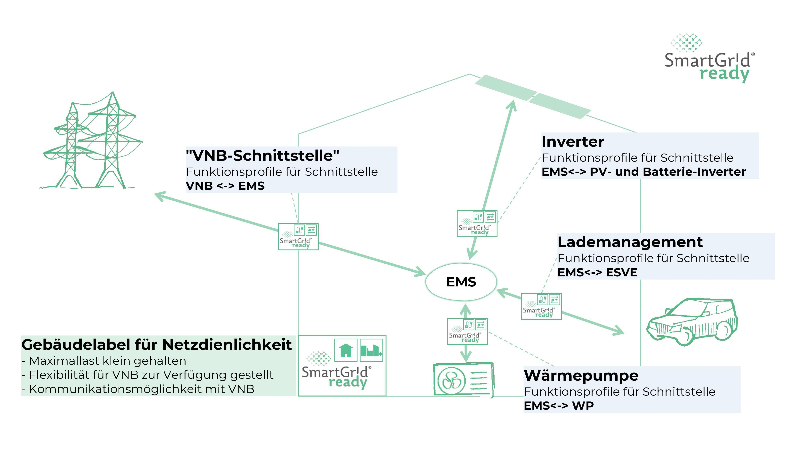
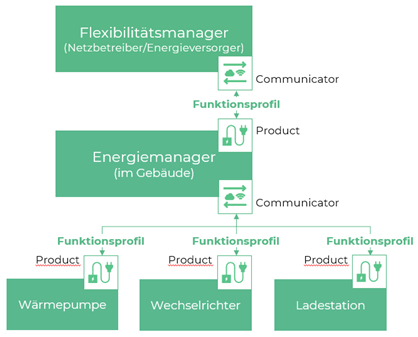

.. _introduction:

Introduction
============

Smart Grids and Energy Management
---------------------------------

A smart power grid is an advanced electricity network that optimizes energy distribution using digital technology,
automation, and real-time data. It enables bi-directional energy flow, integrates renewable energy sources, and enhances
grid stability through automated load balancing and response to energy demand.

Energy management in buildings focuses on monitoring, controlling, and optimizing energy consumption. Smart buildings,
residential areas and industrial areas use energy management devices that read metering and measurement devices and
control power consumers within the building, thereby reducing costs.

Smart buildings and areas interact with smart grids by feeding excess renewable energy into the grid and adjusting energy
usage based on pricing or demand. Microgrids and decentralized energy systems further enhance energy resilience and
self-sufficiency.

The benefits are: Lower costs, reduced carbon footprint, increased reliability, and more consumer control.

:numref:`sgr-environment` illustrates an example of a Smart Grid environment:

.. _sgr-environment:

    SmartGridready Environment

.. list-table:: Component Description
    :widths: 10 40
    :header-rows: 1

    *   -   Component Name
        -   Description

    *   -   :term:`EMS`
        -   An energy management system for buildings, facilities, or residential areas that optimizes energy consumption
            by efficiently managing power consumers.

    *   -   :term:`VNB`-Schnittstelle`
        -   Interface to the power-grid operator. The interface allows load management by the operator and getting tariff
            information from the power-grid operator.

    *   -   Inverter (:term:`PV-Inverter`)
        -   Converts the DC electricity generated by PV solar panels into AC electricity, which is used by household
            appliances and the electrical grid.

    *   -   Lademanagement  (:term:`EVSE`)
        -   Infrastructure used to safely deliver electrical power from the grid to an electric vehicle for charging.
            It includes charging stations, connectors, communication interfaces, and safety mechanisms.

    *   -   Wärmepumpe
        -   A heat pump is an energy-efficient device that transfers heat rather than generating it directly, providing
            both heating and cooling for buildings. It works by moving heat between indoor and outdoor environments using
            a refrigeration cycle.

SmartGridready Concept
----------------------

The goal of SmartGridready is to ensure seamless **interoperability** between energy management devices, energy consuming,
energy producing and energy measuring devices, allowing an intelligent power management.

SmartGridready distinguishes between:

*   Controlled devices referred to as :term:`Product`

    Examples for :term:`Product` devices are smart-meters, heat pumps, :term:`EVSE` charging stations, :term:`PVA` inverters.

*   Controlling devices referred to as :term:`Communicator`

    Examples for :term:`Communicator` devices are Energy Management Systems (:term:`EMS`) and :term:`Flexibility Manager`
    devices operated by power grid operators.

SmartGridready establishes a abstract common framework to enable interoperability between system components, allowing
:term:`Communicator` devices to communicate with :term:`Product` devices in a unified, standardized manner,
independent of the :term:`Product` suppliers and their proprietary communication interfaces.

Interoperability is achieved by :term:`Functional Profile` definitions and :term:`External Interface Definition` (:term:`EID`)
files in XML that build the core of the SmartGridready specification.
The :term:`External Interface Definition` files define a set of :term:`Functional Profiles` exposed by a specific
:term:`Product` and the rules to adapt the communication from the generic SmartGridready interface to the proprietary
:term:`Product` interface.

Architecture
------------

:numref:`basic-architecture` illustrates the basic architecture of a SmartGridready environment.

.. _basic-architecture:

    Basic architecture

.. list-table:: Component descriptions
    :widths: 10 40
    :header-rows: 1

    *   - Component
        - Description

    *   - :term:`Flexibility Manager`
        - Acts as a load manager in a power grid. Allows flexible power management by communicating with Energy Managers :term:`EMS` within sub-networks, residential areas and buildings.

    *   - :term:`Communicator`
        - Part of the :term:`Flexibility Manager` or :term:`EMS` that communicates with :term:`Product` devices within the system. SmartGridready allows a communicator communicate with any :term:`Product` device through standardized interface.

    *   - :term:`Functional Profile`
        - The :term:`Functional Profile` defines a set of standardized functionalities exposed by a :term:`Product` device. The :term:`Functional Profile` forms the core of the SmartGridready standard, enabling flawless communication with any :term:`Product` device that conforms to the SmartGridready specification.

    *   - :term:`Energy Manager`
        - Acts as a power manager within a building. Provides a Smart Grid Connection Point :term:`SGCP` receiving commands from :term:`Flexibility Manager` devices.

    *   - Heat pump,

          :term:`PVA` inverter,

          :term:`EVSE` charging station

        - Samples for :term:`Product` devices

Further documentation
---------------------
`SmartGridready home page <https://smartgridready.ch/>`_

`SmartGridready GitHub projects home <https://github.com/SmartGridready>`_

.. toctree::
    :caption: Contents
    :maxdepth: 3