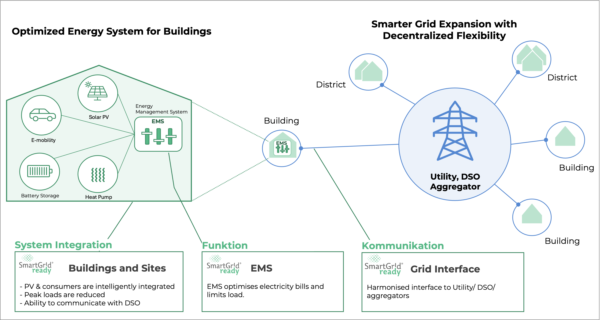
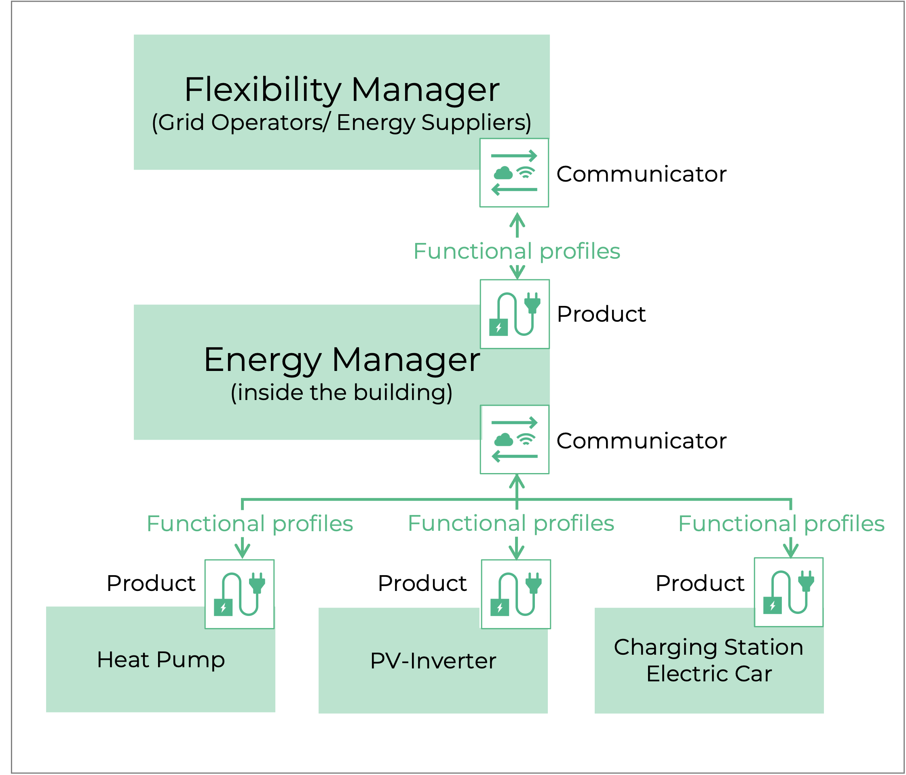

.. _introduction:

Introduction
==============================================

:ref:`Target audience : <table-1>` |planner| |supplier| |grid| |dev|

About SmartGridready – Motivation and Association
-------------------------------------------------

SmartGridready is an independent association dedicated to advancing intelligent networking and communication within the power grid. In doing so, we make an important contribution to Switzerland's energy transition.

SmartGridready is an initiative, which unites manufacturers, grid operators, technology providers, planners, and users. The association's mission is to promote open, interoperable, and future-proof solutions for smart energy systems, supporting the digital transformation of the energy sector.

**Why SmartGridready?**

- **Goals:** Simplify and standardize integration and communication between energy management systems, devices, and the power grid—regardless of manufacturer. Foster innovation and accelerate the adoption of intelligent energy solutions.
- **Benefits:** Lower integration costs, greater flexibility, improved security of supply, and a sustainable foundation for digital energy services. All stakeholders benefit from standardized interfaces and a growing community.
- **Stakeholders:** Manufacturers, energy suppliers, grid operators, planners, architects, technology providers, and end users.

For more information about the association, its members, and activities, visit the official website: `smartgridready.ch <https://smartgridready.ch/>`_

Smart Grids and Energy Management
---------------------------------

A smart grid is a modern electricity network that optimizes energy flows using digital technologies, automation, and real-time data. It enables bidirectional energy flows, integration of renewable energy, and stable grid operation through automated load management.

Energy management in buildings and districts involves monitoring, controlling, and optimizing energy consumption. Intelligent systems read measurement data and control loads to reduce costs and increase efficiency. Buildings and districts interact with the grid by feeding in surplus energy or flexibly adjusting their consumption. Decentralized systems and microgrids increase resilience and independence.

The benefits: lower costs, reduced CO2 emissions, higher security of supply, and more control for users.

:numref:`sgr-environment` shows an example of a SmartGridready environment:

.. _sgr-environment:

    SmartGridready Environment

.. list-table:: Component Description
    :widths: 10 40
    :header-rows: 1

    *   -   Component
        -   Description

    *   -   :term:`EMS`
        -   Energy management system for buildings, districts, or plants to optimize energy consumption.

    *   -   :term:`Grid Interface`
        -   Interface to the distribution grid operator for feed-in and load management and tariff information.

    *   -   Inverter (:term:`PV-Inverter`)
        -   Converts the direct current generated by PV systems into alternating current for households and the grid.

    *   -   Load Management (:term:`EVSE`)
        -   Infrastructure for the safe charging of electric vehicles, including communication and safety.

    *   -   Heat Pump
        -   Efficient device for heating and cooling by transferring heat between the indoor and outdoor environment.

SmartGridready Concept
----------------------

The goal of SmartGridready is to ensure seamless **interoperability** between energy management devices, energy consuming,
energy producing and energy measuring devices, allowing an intelligent power management.

SmartGridready distinguishes between:

*   Controlled devices referred to as :term:`Product`

    Examples for :term:`Product` devices are smart-meters, heat pumps, :term:`EVSE` charging stations, :term:`PVA` inverters.

*   Controlling devices referred to as :term:`Communicator`

    Examples for :term:`Communicator` devices are Energy Management Systems (:term:`EMS`) and :term:`Flexibility Manager`
    devices operated by power grid operators.

SmartGridready establishes a abstract common framework to enable interoperability between system components, allowing
:term:`Communicator` devices to communicate with :term:`Product` devices in a unified manner,
independent of the :term:`Product` suppliers and their proprietary communication interfaces.

Interoperability is achieved by :term:`Functional Profile` definitions and :term:`External Interface Definition` (:term:`EID`)
files in XML that build the core of the SmartGridready specification.
The :term:`External Interface Definition` files define a set of :term:`Functional Profiles` exposed by a specific
:term:`Product` and the rules to adapt the communication from the generic SmartGridready interface to the proprietary
:term:`Product` interface.

Architecture
------------

:numref:`basic-architecture` illustrates the basic architecture of a SmartGridready environment.

.. _basic-architecture:

    Basic architecture

.. list-table:: Component descriptions
    :widths: 10 40
    :header-rows: 1

    *   - Component
        - Description

    *   - :term:`Flexibility Manager`
        - Acts as a load manager in a power grid. Allows flexible power management by communicating with Energy Managers :term:`EMS` within sub-networks, residential areas and buildings.

    *   - :term:`Communicator`
        - Part of the :term:`Flexibility Manager` or :term:`EMS` that communicates with :term:`Product` devices within the system. SmartGridready allows a communicator communicate with any :term:`Product` device through standardized interface.

    *   - :term:`Functional Profile`
        - The :term:`Functional Profile` defines a set of standardized functionalities exposed by a :term:`Product` device. The :term:`Functional Profile` forms the core of the SmartGridready standard, enabling flawless communication with any :term:`Product` device that conforms to the SmartGridready specification.

    *   - :term:`Energy Manager`
        - Acts as a power manager within a building. Provides a Smart Grid Connection Point :term:`SGCP` receiving commands from :term:`Flexibility Manager` devices.

    *   - Heat pump,

          :term:`PVA` inverter,

          :term:`EVSE` charging station

        - Samples for :term:`Product` devices

Resources
---------

The official SmartGridready GitHub organization hosts open-source tools, libraries, and reference implementations for developers and integrators:

- `SmartGridready GitHub projects <https://github.com/SmartGridready>`_

.. toctree::
    :caption: Contents
    :maxdepth: 3